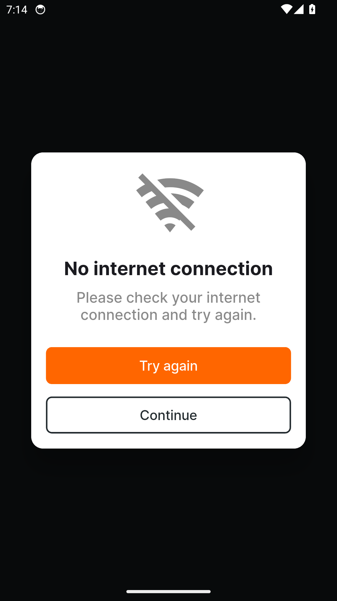
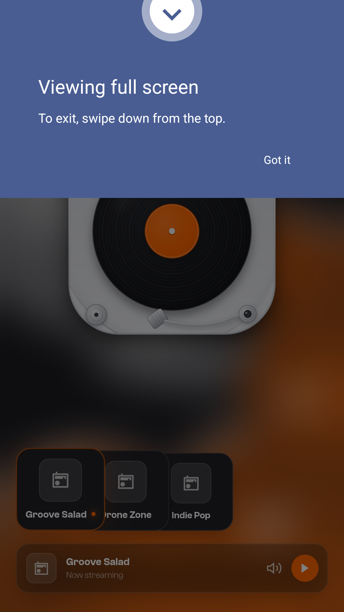
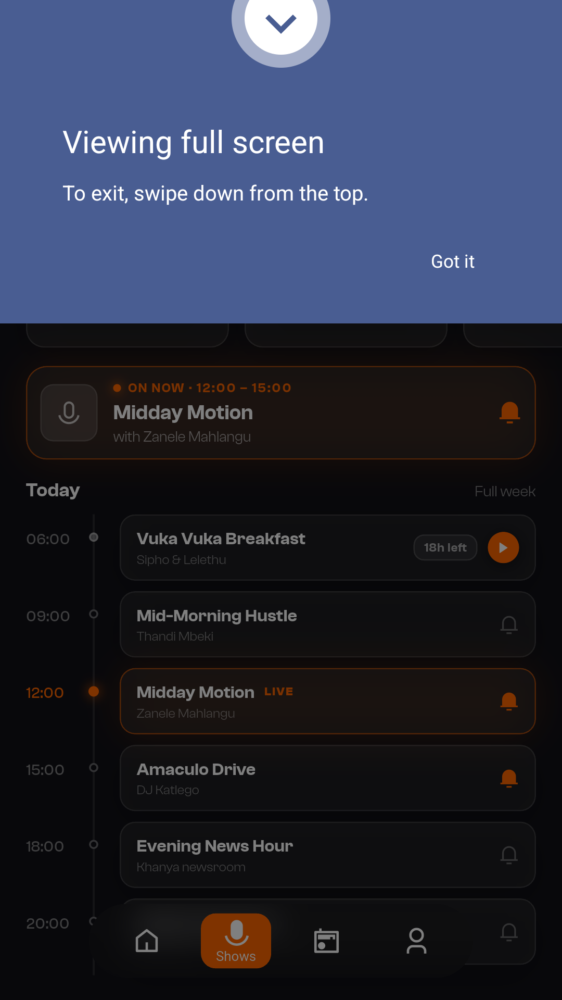
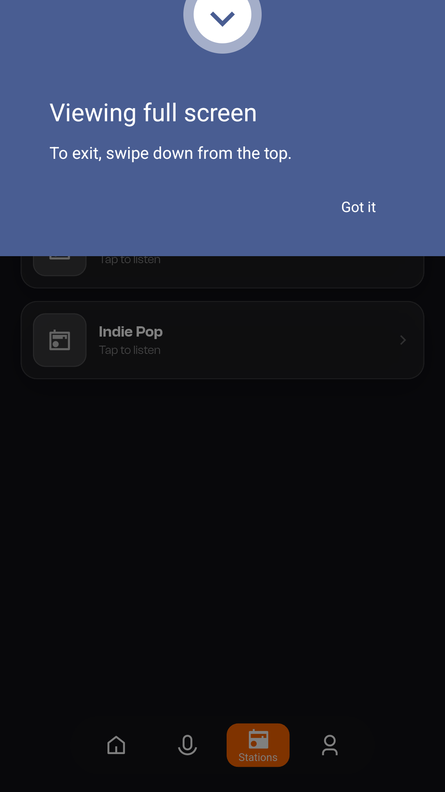
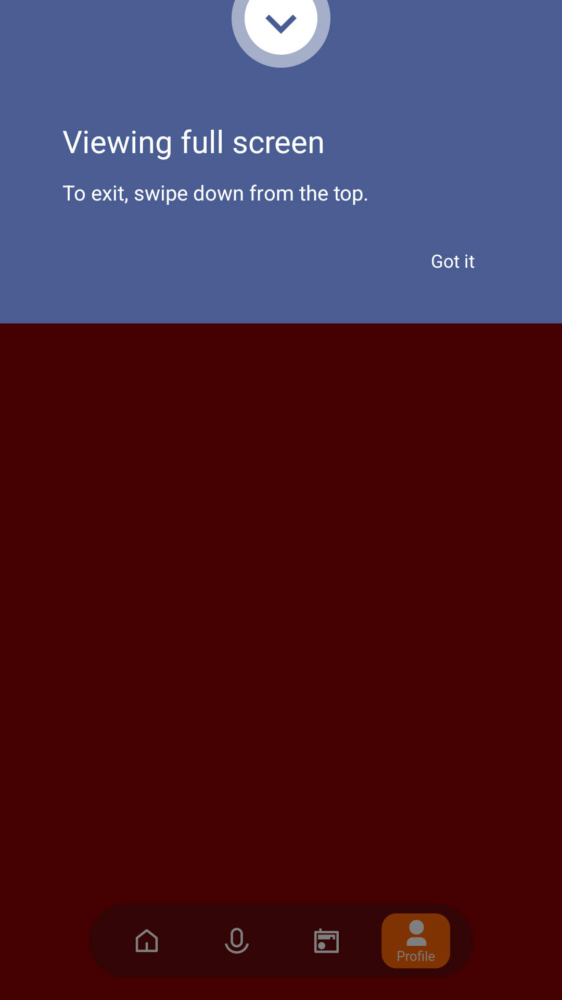

# Musina FM — Feature Guide

Can you handle the Heat?

> This guide is generated automatically on every merge: CI builds the
> app, walks the guided tour on an Android emulator, and captures
> each screen below.

## 1. Welcome to Musina FM

Musina FM - Can you handle the Heat? - opens straight onto the record player.

## 2. Your station, live

Musina FM opens straight into the player - artwork, track and transport, one tap
from on air - your stations fanned like a deck of cards, the now-playing pill
floating beneath.

## 3. Shows, one swipe away

Swipe right for the programme - what's on now, today's line-up with follow
bells, and catch-up cards before they expire.

## 4. Every station in one place

The whole roster on one page - retune with a tap and the player follows.

## 5. Yours, signed in or not

Your identity, your plan and the app's links, all in one quiet place.

## 6. Sleep timer

Drift off with the radio on - the sleep timer stops playback for you.

## 7. Set and forget

Spin the dial and the countdown is ready when you are.
